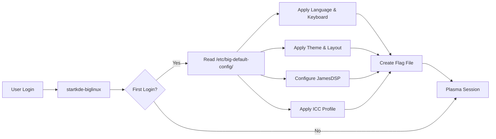

<div align="center">

# 🎨 BigLinux Session & Themes

**The Core Session Management & Theme Engine for BigLinux**

[](LICENSE)
[](https://kde.org/)
[](https://biglinux.com.br/)

</div>

---

## 📖 Table of Contents

- [Overview](#-overview)
- [Architecture](#-architecture)
- [Project Structure](#-project-structure)
- [Key Components](#-key-components)
- [Theme Presets](#-theme-presets)
- [Development](#-development)
- [License](#-license)

---

## 📋 Overview

**biglinux-session-and-themes** is the heart of the BigLinux user experience. It governs how the KDE Plasma session initializes, how themes are applied across different toolkits (Qt, GTK), and how hardware-specific configurations (like audio and display profiles) are managed.

It ensures that the first time a user logs in, their environment looks and feels exactly as they configured it during installation.

---

## 🏗️ Architecture

### First Login Flow

The initialization process ensures a seamless handover from the installer to the user session:



### Configuration Source

Settings are sourced from the following files, populated by the installer:

| File | Description |
|------|-------------|
| `big_language` | System Locale (e.g., `pt_BR.UTF-8`) |
| `big_keyboard` | X11 Keyboard Layout |
| `big_desktop_theme` | Selected Visual Theme |
| `big_desktop_changed` | Desktop Layout Preset |
| `big_enable_jamesdsp` | Audio Enhancement Flag |

---

## 📁 Project Structure

```tree
biglinux-session-and-themes/
├── pkgbuild/                 # Arch Linux packaging files
├── locale/                   # Translations
└── usr/
    ├── bin/
    │   ├── startkde-biglinux      # Main session bootstrapper
    │   ├── big-theme-plasma       # Plasma theme applicator
    │   ├── big-theme-apps         # Universal app themer (GTK/Qt)
    │   ├── big-wallpaper-random   # Smart wallpaper rotation
    │   └── detect_window_monitor  # Multi-monitor heuristic
    ├── lib/systemd/               # User services
    └── share/biglinux/            # Assets and configs
```

---

## 🔧 Key Components

### `startkde-biglinux`
The primary entry point. It orchestrates the setup of:
- **Language**: Exports `$LANG` and `$LC_*`.
- **Input**: Configures keyboard layouts via `setxkbmap`.
- **Visuals**: Triggers theme scripts.
- **Hardware**: Activates ICC profiles and audio processing.

### `big-theme-plasma` & `big-theme-apps`
The consistency engines. They synchronize:
- **Plasma**: Color schemes, window decorations, icons, quarks.
- **Applications**: GTK2/3/4 themes, Qt5/6 styles, and Kvantum themes.

### `big-wallpaper-random`
A smart wallpaper manager that:
- Selects high-quality backgrounds from the system pool.
- Validates contrast for readability.
- Respects light/dark mode preferences.

---

## 🎯 Theme Presets

BigLinux offers professionally curated styling options:

| Preset | Vibe | Primary Palette |
|--------|------|-----------------|
| **Classic** | Clean, traditional | Blue / White |
| **Dark** | Modern, professional | Slate Gray / Blue |
| **Breeze** | Stock KDE look | Breeze Defaults |
| **Custom** | User defined | Mixed |

---

## 🛠️ Development

### Building the Package

```bash
cd pkgbuild
makepkg -si
```

### Testing Theme Changes

Isolate and test specific components:

```bash
# Apply "Dark" theme preset
big-theme-plasma "BigLinux Dark"

# Sync application themes
big-theme-apps

# Force wallpaper rotation
big-wallpaper-random
```

### Dependencies
- `plasma-workspace`, `plasma-framework`
- `kvantum`, `qt5-base`, `qt6-base`
- `gtk3`, `gtk4`

---

## 🤝 Contributing

Contributions are welcome! Please follow these steps:

1. Fork the repository.
2. Create a feature branch (`git checkout -b feature/amazing-feature`).
3. Commit your changes (`git commit -m 'Add amazing feature'`).
4. Push to the branch (`git push origin feature/amazing-feature`).
5. Open a Pull Request.

---

## 📄 License

Distributed under the **GPL-3.0 License**. See [LICENSE](LICENSE) for more information.

---

<div align="center">

**Made with 💚 by the BigLinux Team**

[Website](https://biglinux.com.br)

</div>
